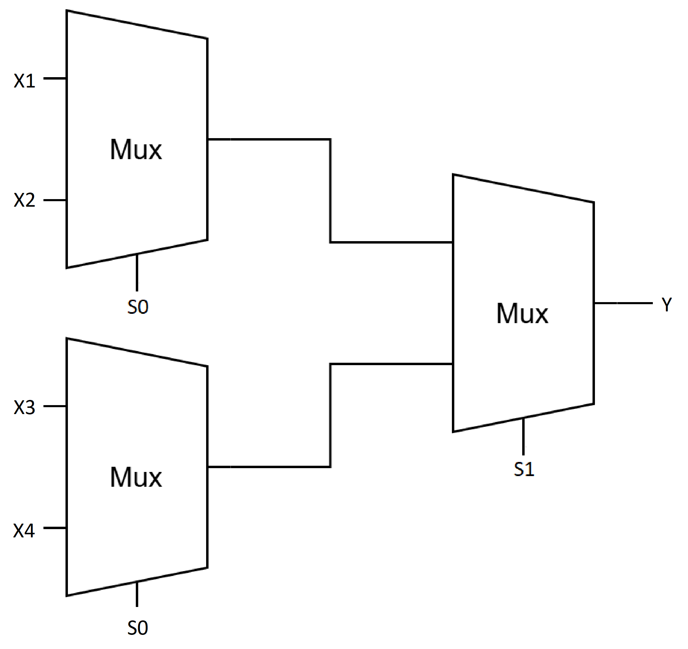
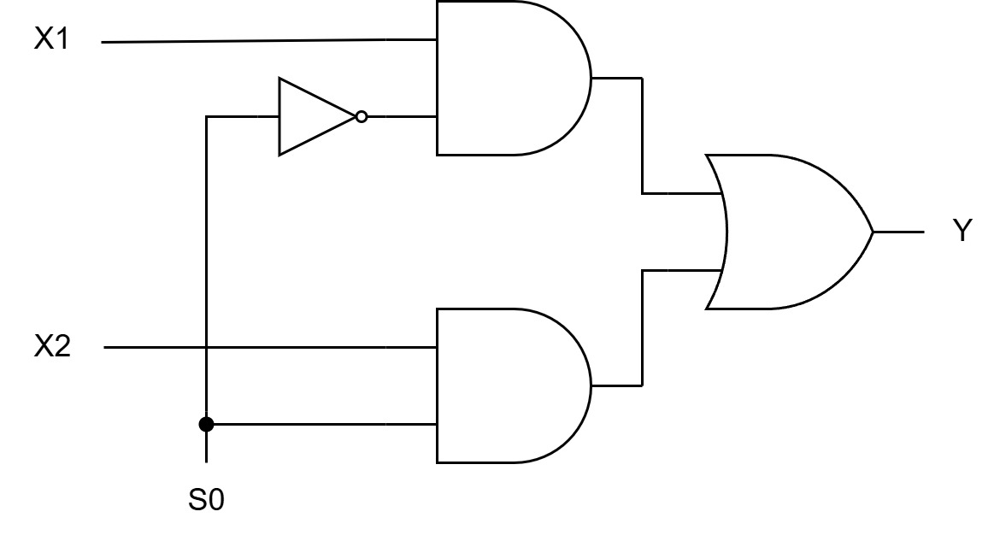
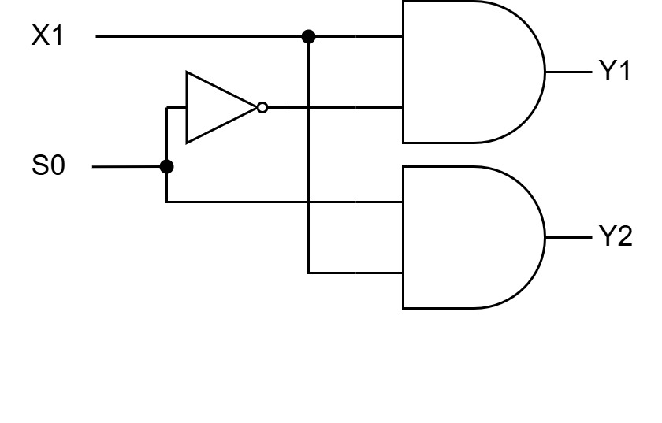
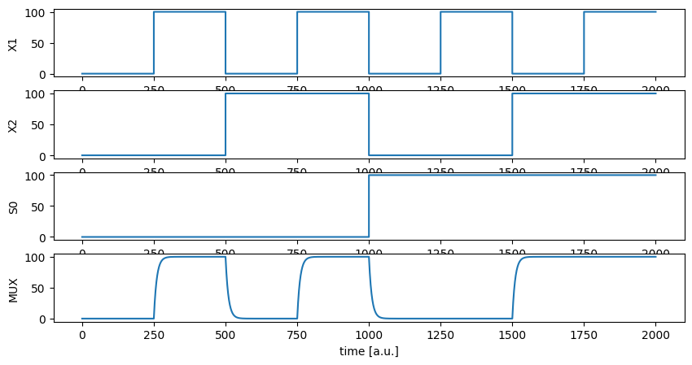
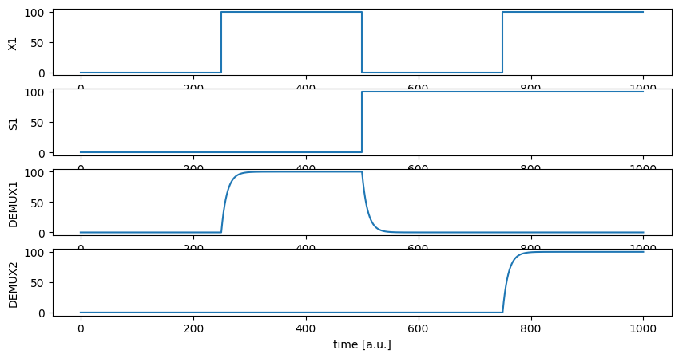

# Splošen MUX in DEMUX z orodjem GReNMlin (začasen naslov)

## Uvod

### Gensko regulatorno omrežje

V biološkem procesiranju je modeliranje genskih regulacijskih omrežij (GRN) ključen računalniški pristop za raziskovanje kompleksnih regulacijskih interakcij med geni, transkripcijskimi faktorji in vplivi iz okolja. Ta omrežja uravnavajo izražanje genov, kar omogoča celicam, da se prilagodijo okolju, diferencirajo v specifične celične tipe in ohranjajo homeostazo. Z uporabo računalniških tehnik za modeliranje GRN lahko raziskovalci simulirajo in napovedujejo vedenje bioloških sistemov, analizirajo njihovo robustnost na motnje ter načrtujejo sintetične regulacijske sisteme za biotehnološke ali medicinske aplikacije.

Modeliranje genskega izražanja je v zadnjih desetletjih postalo nepogrešljivo orodje v biološkem raziskovanju. Simulacije omogočajo preverjanje hipotez o izražanju genov, kar zmanjšuje potrebo po dolgotrajnih in dragih eksperimentih. Računalniško podprto modeliranje omogoča raziskovalcem, da preverijo pravilnost hipotez s simulacijami, kar zmanjšuje tveganje za neuspešne eksperimente. Pristop omogoča iterativni razvoj hipotez in eksperimentalnih načrtov, s čimer pospeši napredek pri razumevanju bioloških procesov.

### GReNMlin

GReNMlin (Gene Regulatory Network Modeling) je Pythonov paket, zasnovan za konstruiranje, simulacijo in analizo osnovnih logičnih komponent, kot so multiplekserji, števci in druga digitalna vezja, z uporabo genskih regulacijskih omrežij. Temelji na sistemih diferencialnih enačb, ki opisujejo dinamiko interakcij med geni in njihovimi regulatorji. Te enačbe omogočajo natančno modeliranje procesov, kot so aktivacija, represija in sinteza genov, kar uporabnikom omogoča simulacijo vedenja GRN v času.

Postopek modeliranja logičnih komponent s pomočjo GRN v GReNMlinu je zasnovan na naslednjih korakih:

Definicija omrežja: 
1. Omrežje je definirano s specifikacijo species (vhodne in izhodne vrste), regulatorjev (povezave med vhodnimi vrstami) in produkta (izhodne vrste).
2. Uporaba oblike SOP: Na podlagi preučenih primerov smo ugotovili, da je najpreprostejši način za realizacijo osnovnih logičnih komponent preoblikovanje njihovih formul v obliko Sum of Products (SOP). Pri tem vsak regulator ustreza enemu produktu (AND), združevanje več regulatorjev v en produkt pa ustreza njihovi vsoti (OR). Funkcija NOR se doseže z inverzijo tipa regulatorja.
3. Enostavna izdelava komponent: Ta pristop omogoča preprost in pregleden način za izdelavo osnovnih logičnih komponent s pomočjo GRN. Poleg tega zagotavlja čiste signale že privzeto, brez potrebe po optimizaciji parametrov, kot sta kd ali n.

### Multiplekser

Multiplekser je osnovno logično vezje, ki ima pomembno vlogo v računalniškem svetu.
Njegova zasnova vključuje $2^n$ vhodnih signalov, $n$ adresnih signalov (katere poimenujemo tudi kontrolni signali oziroma izbirne linije) in en izhodni signal.
Njegovo osnovno delovanje temelji na izbiri enega izmed vhodnih signalov glede na vrednosti adresnih signalov in preslikava izbranega signala na izhod.

Uporaba multiplekserjev je široka in obsega različna področja.
V digitalnih sistemih se multiplekserji uporabljajo za usmerjanje signalov, optimizacijo vodil in zmanjšanje števila potrebnih povezav.
V procesorskih enotah se pogosto uporabljajo za izbiro med različnimi viri podatkov ali ukazov, v komunikacijskih sistemih pa omogočajo združevanje več signalov na eno prenosno pot, kar povečuje učinkovitost prenosa.

Hkrati multiplekserji predstavljajo poln funkcijski nabor.
To pomeni, da z uporabo multiplekserjev lahko implementiramo poljubno logično funkcijo.
Prav tako pa lahko z združevanjem več osnovnih (npr. 2:1) multiplekserjev ustvarimo večje in zmogljivejše multiplekserje, kot so 4:1, 8:1 in še večji.
Slika (REF kombiniranje_muxov.png) prikazuje primer kombiniranja osnovnih multiplekserjev, za izgradnjo kompleksnejšega multiplekserja.



Na sliki (REF MUX-log-vezje.jpg) je prikazana najbolj osnovna logična predstavitev multiplekserja, izvedena z uporabo NOT, AND in OR logičnih vrat, po kateri smo se tudi zgledovali pri realizaciji multiplekserja z orodjem GReNMlin.



### Demultiplekser

Demultiplekser (DEMUX) je logično vezje, katerega delovanje je obratno od multiplekserja, vendar temelji na podobnem principu uporabe adresnih signalov.
Medtem ko multiplekser omogoča izbiro enega izmed več vhodnih signalov in ga usmeri na izhod, demultiplekser prejme en vhodni signal in ga preusmeri na enega izmed izhodnih signalov.
Zasnovan je torej z enim vhodnim signalom, $n$ adresnimi signali in $2^n$ izhodnimi signali.

Demultiplekserji so nepogrešljivi v digitalnih sistemih, kjer je treba razporediti podatke ali signale iz enega vira na več ciljev.
Uporabljajo se v komunikacijskih sistemih za distribucijo signalov v več kanalov, pri dekodiranju naslovov v pomnilniških enotah in v procesorjih za upravljanje z ukazi.

Slika (REF DEMUX-log-vezje.jpg) prikazuje osnovno logično predstavitev demultiplekserja, katero izvedemo z uporabo NOT in AND logičnih vrat.
Tudi ta shema je služila za zgled pri implementaciji multiplekserja z orodjem GReNMlin.



## Implementacija MUX in DEMUX z orodjem GReNMlin

### 2:1 MUX

2:1 MUX smo z orodjem GReNMlin implementirali po Sliki (REF MUX-log-vezje.jpg), kot je razvidno iz odseka programske kode (REF na izsek programske kode 2:1 MUX).

```python
# input species
my_grn.add_input_species("X1")
my_grn.add_input_species("X2")
my_grn.add_input_species("S1")

# output species
my_grn.add_species("MUX", 0.1)

# X1 AND NOT S1
regulators = [{'name': 'X1', 'type': 1,  'Kd': 5, 'n': 2},
              {'name': 'S1', 'type': -1, 'Kd': 5, 'n': 3}]
products = [{'name': 'MUX'}]
my_grn.add_gene(10, regulators, products)

# X2 AND S1
regulators = [{'name': 'X2', 'type': 1, 'Kd': 5, 'n': 2},
              {'name': 'S1', 'type': 1, 'Kd': 5, 'n': 3}]
products = [{'name': 'MUX'}]
my_grn.add_gene(10, regulators, products)
```

Implementacija osnovnega 2:1 multiplekserja je od samega začetka delovala brez težav, kar je razvidno tudi na sliki (REF rezultati 2:1 MUX-a).
Ta uspešna zasnova je služila kot osnova za razvoj bolj kompleksnih multiplekserjev, kot sta 4:1 in 8:1 MUX, pri katerih prav tako nismo naleteli na nikakršne težave.
Na podlagi teh rezultatov se kaže velik potencial za razvoj funkcije posplošenega multiplekserja.
Takšna funkcija bi omogočala generiranje multiplekserjev poljubne kompleksnosti glede na število vhodnih linij, ki jih določi uporabnik.
Posplošeni multiplekser bi lahko predstavljal dodatek oziroma izboljšavo obstoječega orodja GReNMlin.



### Posplošen MUX

Posplošen MUX smo razvili po izrazu:

$$
Y = (X_1 \cdot \overline S_1 \cdot \overline S_2 \cdot \dots \cdot \overline S_{\log_2 N}) + (X_2 \cdot S_1 \cdot \overline S_2 \cdot \dots \cdot \overline S_{\log_2 N}) + \dots + (X_N \cdot S_1 \cdot S_2 \cdot \dots \cdot S_{\log_2 N})
$$

Izsek programske kode (REF na izsek programske kode za posplošen MUX) prikazuje logiko delovanja funkcije, ki zgenerira poljuben MUX, definiran s parametrom N, ki predstavlja število vhodnih linij.
Na začetku najprej preverimo, da je uporabnik za parameter N vnesel potenco števila 2, ki je večja od 1 (torej 2, 4, 8, 16, ...), nato definiramo ustrezno število vhodnih in izhodnih vrst (angl. species), na koncu pa generiramo željeni MUX po zgoraj definiranem izrazu.

```python
# Check if N is power of 2
if (N < 2) or not (N and (N & (N - 1)) == 0):
    raise ValueError("N must be a power of 2 and larger than 1 (e.g., 2, 4, 8, 16, ...)")

num_select_lines = int(np.log2(N))

# Initialize GRN
my_grn = grn.grn()

# Add input species for data lines X1, X2, ..., XN
for i in range(1, N + 1):
    my_grn.add_input_species(f"X{i}")

# Add input species for select lines S1, S2, ..., Slog2(N)
for i in range(1, num_select_lines + 1):
    my_grn.add_input_species(f"S{i}")

# Add output species for MUX
my_grn.add_species("MUX", 0.1)

# MUX logic
for i in range(1, N + 1):
    # Determine binary representation
    binary_select = f"{i - 1:0{num_select_lines}b}"[::-1]

    # Define regulators for the current gene
    regulators = [{"name": f"X{i}", "type": 1, "Kd": 5, "n": 2}]
    for j, bit in enumerate(binary_select):
        regulators.append({
            "name": f"S{j + 1}",
            "type": 1 if bit == "1" else -1,
            "Kd":   5,
            "n":    3
        })

    # Define products for the current gene
    products = [{"name": "MUX"}]

    # Add the gene to the GRN
    my_grn.add_gene(10, regulators, products)
```

Testiranje funkcije za posplošen multiplekser je pokazalo, da funkcija deluje pravilno in skladno s pričakovanji.
Edina težava, na katero smo naleteli, je strmo naraščanje časa simulacije s povečevanjem parametra N.
Medtem ko je simulacija 2:1 in 4:1 multiplekserja trajala manj kot sekundo, je simulacija 8:1 multiplekserja zahtevala že 30 sekund.
Izvedba 16:1 multiplekserja pa je trajala tako dolgo, da časa nismo uspeli izmeriti.
Po sedmih urah delovanja funkcije še vedno ni bilo videti, da bi se simulacija kmalu zaključila, zato smo jo ročno prekinili.
Funkcijo za posplošen multiplekser bi bilo torej smiselno uporabljati le za osnovnejše multiplekserje (2:1, 4:1 in 8:1 MUX).

| N   | Čas za izvedbo (sekunde) |
| --- | -----------------------: |
| 2   |                     0.12 |
| 4   |                     0.43 |
| 8   |                    33.86 |

### 2:1 DEMUX

2:1 DEMUX smo implementirali po Sliki (REF DEMUX-log-vezje.jpg).
Implementacija je prikazana v izseku programske kode (REF na izsek programske kode za 2:1 DEMUX).

```python
# input species
my_grn.add_input_species("X1")
my_grn.add_input_species("S1")

# output species
my_grn.add_species("DEMUX1", 0.1)
my_grn.add_species("DEMUX2", 0.1)

# X1 AND NOT S1
regulators = [{'name': 'X1', 'type': 1,  'Kd': 5, 'n': 2},
              {'name': 'S1', 'type': -1, 'Kd': 5, 'n': 3}]
products = [{'name': 'DEMUX1'}]
my_grn.add_gene(10, regulators, products)

# X1 AND S1
regulators = [{'name': 'X1', 'type': 1, 'Kd': 5, 'n': 2},
              {'name': 'S1', 'type': 1, 'Kd': 5, 'n': 3}]
products = [{'name': 'DEMUX2'}]
my_grn.add_gene(10, regulators, products)
```

Rezultati testiranja so prikazani na Sliki (REF rezultati testiranja 2:1 DEMUX-a).



Tudi pri implementaciji demultiplekserjev nismo naleteli na nobene težave.
Brez problemov smo razvili tudi kompleksnejše (4:1, 8:1, ...) demultiplekserje.
Tudi tokrat smo opazili potencial, za razvoj funkcije za generiranje posplošenega demultiplekserja, ki bi se poleg posplošenega multiplekserja lahko vključila kot izboljšava orodja GReNMlin.

### Posplošen DEMUX

Posplošen DEMUX smo razvili po sledečih izrazih:

$$
Y_1 = X_1 \cdot \overline S_1 \cdot \overline S_2 \cdot \dots \cdot \overline S_{\log_2{N}}\\
Y_2 = X_1 \cdot S_1 \cdot \overline S_2 \cdot \dots \cdot \overline S_{\log_2{N}}\\
\vdots\\
Y_N = X_1 \cdot S_1 \cdot S_2 \cdot \dots \cdot S_{\log_2{N}}
$$

Izsek programske kode (REF na izsek programske kode za posplošen DEMUX), prikazuje našo implementacijo funkcije.
Funkcija deluje na zelo podobnem principu, kot funkcija za posplošen MUX, torej najprej preverimo ali je uporabnik vnesel ustrezen parameter N, nato definiramo vhodne in izhodne vrste, sledi pa DEMUX logika, ki po zgoraj definiranem logičnem izrazu ustrezno nastavi regulatorje.

```python
# Check if N is power of 2
if (N < 2) or not (N and (N & (N - 1)) == 0):
    raise ValueError("N must be a power of 2 and larger than 1 (e.g., 2, 4, 8, 16, ...)")

num_select_lines = int(np.log2(N))

# Initialize the GRN
my_grn = grn.grn()

# Add input species X1 and S1, S2, ..., Slog2(N)
my_grn.add_input_species("X1")
for i in range(1, num_select_lines + 1):
    my_grn.add_input_species(f"S{i}")

# Add output species for each Y_i
for i in range(1, N + 1):
    my_grn.add_species(f"DEMUX{i}", 0.1)

# DEMUX logic
for i in range(1, N + 1):
    # Determine binary representation
    binary_select = f"{i - 1:0{num_select_lines}b}"[::-1]

    # Define regulators
    regulators = [{'name': 'X1', 'type': 1, 'Kd': 5, 'n': 2}]
    for j, bit in enumerate(binary_select):
        regulators.append({
            "name": f"S{j + 1}",
            "type": 1 if bit == "1" else -1,
            "Kd": 5,
            "n": 3
        })

    # Output gene for DEMUX_i
    products = [{'name': f"DEMUX{i}"}]

    # Add the gene to the GRN
    my_grn.add_gene(10, regulators, products)
```

Tudi tokrat je funkcija delovala skladno s pričakovanji.
Poleg tega pa je funkcija delovala hitreje, kot funkcija za posplošen MUX.
Čas izvedbe je še vedno naraščal s parametrom N, vendar tokrat manj strmo.
Čas za izvedbo funkcije, glede na velikost parametra N je podan v spodnji tabeli (REF na tabelo).

| N   | Čas za izvedbo (sekunde) |
| --- | -----------------------: |
| 2   |                     0.11 |
| 4   |                     0.14 |
| 8   |                     0.36 |
| 16  |                     2.12 |
| 32  |                    16.22 |

## Optimizacija

## Zaključek
